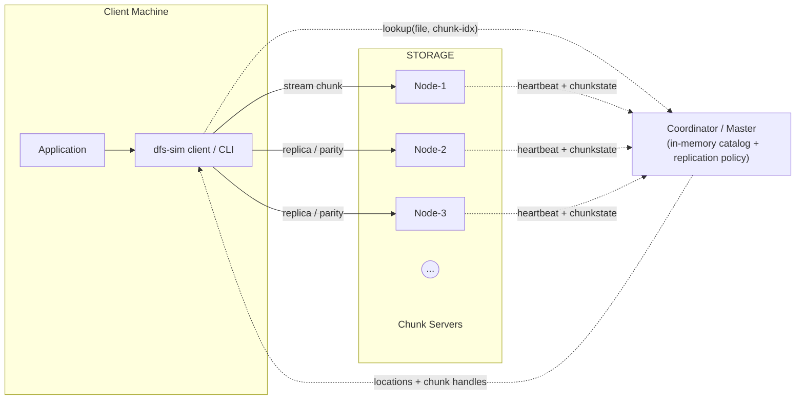

# Distributed File Store Simulator

> A learning-oriented mini-distributed file-system written in Rust, focused on **chunking, hashing, compression, replication and parity recovery**—loosely inspired by the design ideas of the [Google File System (GFS)](https://pdos.csail.mit.edu/6.824/papers/gfs.pdf).

Inspirational parallels to GFS:

* **Large immutable chunks** minimise master interactions and make sequential I/O efficient.
* **Master + chunkserver mindset** (here: *coordinator* + *nodes*) keeps metadata centralised but datapath peer-to-peer.
* **Replication & cheap hardware**: tolerate node loss by re-replicating or rebuilding from parity.


## Project Status

**Under active development (pre-v1)**


## Goals / Feature Checklist

* [x] **CLI scaffold** via `clap` (`put`, `get`, `node`, `coord`)
* [x] **Chunker**: fixed-size splitter + SHA-256 hash table + unit tests
* [x] **In-memory catalog** mapping `file → chunks → nodes`
* [x] **Configurable replication factor** (round-robin placement)
* [x] **LZ4 compression** on each chunk
* [ ]   `put` Operation
* [ ] **XOR parity per block-set**; offline node recovery
* [ ] **Download path** involving checksum verification, decompression, & reassembly
* [ ] **Benchmarks** with `hyperfine` + `flamegraphs`
* [ ] **Parallel transfer path** (`threads` or `Tokio`)
* [ ] **Error handling** of edge cases
* [ ] **Usage examples & retrospective** in README
* [ ] **Stretch**: gRPC streaming, consistent-hash ring, Reed–Solomon erasure coding


## Planned Architecture



*Solid arrows*: data path.  
*Dashed arrows*: metadata / control.


## Anticipated Functionality

```bash
# three nodes
dfs-sim node --id n1 --listen 127.0.0.1:4001
dfs-sim node --id n2 --listen 127.0.0.1:4002
dfs-sim node --id n3 --listen 127.0.0.1:4003

# coordinator
dfs-sim coord --nodes 127.0.0.1:4001,127.0.0.1:4002,127.0.0.1:4003 \
              --replication 2 --parity xor

# store & retrieve
dfs-sim put ./large.iso --name iso/ubuntu.iso
dfs-sim get iso/ubuntu.iso --out ./restore.iso
```

Bring one node down (`Ctrl-C n1`) and repeat `dfs-sim get …` to watch parity recovery in logs.


## How it works (design details)

### Data path

1. **PUT**: CLI streams file ➜ Coordinator
2. Coordinator splits into *k* MB chunks, computes SHA-256, compresses, picks replica + parity layout, then **streams each chunk to selected nodes in parallel** (round-robin for now).
3. **GET**: Coordinator returns ordered chunk list; CLI concurrently pulls chunks, verifies hash, decompresses, reassembles. Missing chunks trigger parity rebuild on-the-fly.
4. **Node failure simulation**: Bring a node down—catalog notices missed heart-beats, flips state, and read path fetches from replicas or kicks off XOR reconstruction.

### Chunking Engine

* Each chunk is 64 MB. Large enough to amortize metadata, small enough for demo.
* Once written, chunks are **append-only**—mirrors GFS’s design for simpler consistency guarantees.
* Chunker reads file in 64 MB blocks and computes SHA-256 hash, which are stored in a custom data
structure.


### Replication & parity

* Each chunk is streamed to **R** distinct nodes (`--replication R`).
* Optional **XOR parity block** written to a further node set (`--parity xor`), allowing single-node loss recovery.
* Coordinator tracks live nodes; missing replicas are lazily rebuilt in background.

### Coordinator responsibilities

* **Namespace & placement**: chooses nodes, maintains in-memory catalog (serialised to disk on exit).
* **Heart-beat & health**: nodes ping every 3 s; missed pings mark node *offline*.
* **Recovery**: scans catalog, schedules background `parity::rebuild()` tasks.

### Compression workflow

1. Chunk bytes → `lz4_flex::compress`
2. Prepend 4-byte original-size header
3. Store compressed buffer; on read, reverse.

### Concurrency story

* `Tokio` runtime (or `std::thread` + channels) drives async transfers.
* Chunk uploads are pipelined; hashes & compression executed in a scoped thread-pool so CPU work overlaps I/O.
* Shared state behind `Arc<Mutex<…>>` to exercise Rust’s ownership model.

### Benchmarks & metrics

Planned with **`hyperfine`** (throughput) and **`cargo-flamegraph`** (hot spots). Report will include:

* PUT/GET MB/s vs. replication factor
* Compression ratio vs. CPU cost
* Restore latency under node loss


## References

* Ghemawat S., Gobioff H., Leung S-T. [*The Google File System.*](https://pdos.csail.mit.edu/6.824/papers/gfs.pdf) SOSP 2003.
* Project outline: [*dfs-simulator-project*](/assets/dfs-simulator-project.pdf) (pdf).


## How to Contribute

Contributions are **welcome soon** once the core scaffolding stabilises. Feel free to open issues for design discussion; pull-requests will be reviewed after an initial public alpha.


## License

Released under the **MIT License** – see [`LICENSE`](LICENSE) for details.

